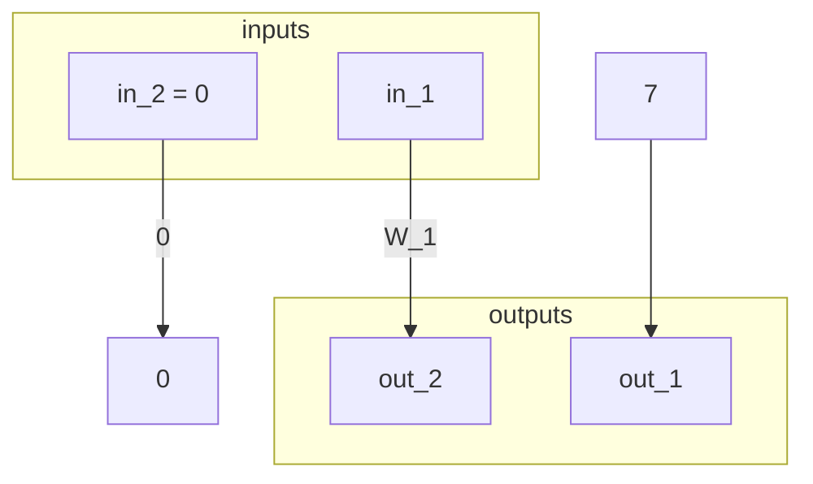

# Chapter 7: Circuit Compilers

As a preliminary for this chapter, let's consider trivial circuit from example 134:

```rs
statement trivial_circuit {F:F_13} {
  fn main{F}(in1 : F, pub in2 : F) -> (F,F) {
    let const outc1 : F = 0 ;
    let const inc1 : F = 7 ;
    let out1 : F ;
    let out2 : F ;
    out1 <== inc1;
    out2 <== in1;
    outc1 <== in2;
    return (out1, out2) ;
  }
}
```

This gets brain-compiled into the following circuit:



## Exercise 103

> Let `F` be the field $\mathbb{F}_5$. Brain-compile the following `PAPER` statement into an algebraic circuit:
>
> ```rs
> statement STUPID_CIRC {F: F_5} {
>   fn foo(in_1: F, in_2: F) -> (out_1: F, out_2: F) {
>     constant c_1: F = 3;
>     out_1 <== ADD(MUL(c_1, in_1), in_1);
>     out_2 <== INV(c_1, in_2);
>   };
>
>   fn main(in_1: F, in_2: F) -> (out_1: F, out_2: TYPE_2) {
>     constant (c_1, c_2): (F, F) = (3, 2);
>     (out_1, out_2) <== foo(in_1, in_2);
>   };
> }
> ```

TODO

## Exercise 104

> Consider the tiny-jubjub curve from example 71 and its associated circuit. Write a statement in `PAPER` that brain-compiles the statement into a circuit equivalent to the one derived in 124, assuming that curve point is the instance (public) and every other assignment is a witness (private).

TODO

## Exercise 105

> Let `F` be the field $\mathbb{F}_{13}$. Define a statement in `PAPER` such that given instance `x` in `F`, a field element `y` in `F` is a witness for the statement if and only if `y` is the square root of `x`.
>
> Brain-compile the statement into a circuit and derive its associated R1CS. Consider the instance `x = 9` and compute a constructive proof for the statement.

TODO

## Exercise 106

> Let `b1` and `b2` be two boolean constrained variables from a finite field. Show that the equation `OR(b1, b2) = 1 - (1 - b1)(1 - b2)` holds true.
>
> Use this equation to derive an algebraic circuit with ingoing variable `b1` and `b2`, and outgoing variable `OR(b1, b2)`.
>
> Finally, transform this circuit into a R1CS and find its full solution set. Define a `PAPER` function that brain-compiles into the circuit.

TODO

## Exercise 107

> Derive algebraic circuits and associated R1CS for the following operators: NOR, XOR, NAND, and EQU.

TODO
