# Chapter 7: Circuit Compilers

As a preliminary for this chapter, let's consider trivial circuit from example 134:

<!-- "main{F}" is wrong in the example, should be "main" -->

```rs
statement trivial_circuit {F: F_13} {
  fn main(in1: F, pub in2: F) -> (F, F) {
    let const outc1: F = 0;
    let const inc1: F = 7;
    let pubout1: F;
    let out2: F;
    out1 <== inc1;
    out2 <== in1;
    outc1 <== in2;
    return (out1, out2);
  }
}
```

This gets brain-compiled into the following circuit:


Note to self: I personally think they don't follow this grammar strictly much. Some examples differ w.r.t the grammar shown in the chapter.

## Exercise 103

> Let `F` be the field $\mathbb{F}_5$. Brain-compile the following `PAPER` statement into an algebraic circuit:
>
> ```rs
> statement STUPID_CIRC {F: F_5} {
>   fn foo(in_1: F, in_2: F) -> (out_1: F, out_2: F) {
>     let const c_1: F = 3;
>     out_1 <== ADD(MUL(c_1, in_1), in_1);
>     out_2 <== INV(c_1, in_2);
>   };
>
>   fn main(in_1: F, in_2: F) -> (out_1: F, out_2: TYPE_2) {
>     let const (c_1, c_2): (F, F) = (3, 2);
>     (out_1, out_2) <== foo(in_1, in_2);
>   };
> }
> ```

The `ADD` and `MUL` gates are trivial, but it is important to note the `INV` gate used here, given in section 7.3.1.1.2:

```rs
fn INV(x: F, y: F) -> F {
  let x_inv: F;
  let const c: F = 1;
  c <== MUL(x, y);
  x_inv <== y;
  return x_inv;
}
```

Basically, `INV(x, y)` constraints `y` to be the multiplicative inverse of `x`. When we brain-compile the statement, we have the resulting equations below:

$$
\begin{align*}
  out_1 &= 3 \cdot in_1 + in_1 \\
  out_2 &= in_2 \\
  1     &= 3 \cdot in_2
\end{align*}
$$

Notice that $in_2$ is constrained to be the inverse of $3$. Also, the constant values in `main` are unused, so we omit them.

We have the algebraic circuit below as a result:

```mermaid
graph TD
  3;

  subgraph inputs
    i1["in_1"]
    i2["in_2"]
  end

  m1(("⋅"))
  m2(("⋅"))
  a1(("+"))
  3 --> m1
  i1 --> m1
  m1 --> a1
  i1 --> a1
  a1 --> o1

  3 --> m2
  i2 --> m2
  m2 --> 1
  i2 --> o2
  subgraph outputs
    o1["out_1"]
    o2["out_2"]
  end
```



## Exercise 104

> Consider the TinyJubJub curve from example 71 and its associated circuit. Write a statement in `PAPER` that brain-compiles the statement into a circuit equivalent to the one derived in example 125, assuming that curve point is the instance (public) and every other assignment is a witness (private).

Our public input is the pair of field elements $(x, y) \in \mathbb{F}_{13}^2$ and the circuit should compute:

$$
1 + 8 \cdot x^2 \cdot y^2 + 10 \cdot x^2 + 12 \cdot y^2
$$

Correct witnesses are those that result in 0 when provided to the equation. We can write the PAPER code as follows:

```rs
statement tiny_jub_jub {F: F_13} {
  fn main(x: F, y: F) -> (F, F) {
    let const (c1, c2, c3, c4): (F, F, F, F) = (1, 8, 10, 12);
    let (xx, yy): (F, F);
    let out: F;
    xx <== MUL(x, x);
    yy <== MUL(y, y);
    out <== ADD(c1, ADD(MUL(c2, MUL(xx, yy)), ADD(MUL(c3, xx), MUL(c4, yy))))
    return out;
  }
}
```

## Exercise 105

> Let `F` be the field $\mathbb{F}_{13}$. Define a statement in `PAPER` such that given instance `x` in `F`, a field element `y` in `F` is a witness for the statement if and only if `y` is the square root of `x`.
>
> Brain-compile the statement into a circuit and derive its associated R1CS. Consider the instance `x = 9` and compute a constructive proof for the statement.

Implementing a square-root algorithm within PAPER does not make sense, we can do much better instead: compute `y` outside and pass it in as a private input (a witness), and return $x = y^2$ as a public output (an instance). This results in the PAPER code below:

```rs
statement sqrt {F: F_13} {
  fn main(y: F) -> (F) {
    let x;
    x <== MUL(y, y);
    return (x);
  }
}
```

We can compile this into the following circuit:

```mermaid
graph LR
  subgraph inputs
    y
  end

  mul(("⋅"))
  y --> mul;
  y --> mul;
  mul --> x;

  subgraph outputs
    x
  end
```



The R1CS of this circuit is quite simple, we only have one constraint:

$$
y \cdot y = x
$$

We have $n=1$ instance, $m=1$ witness, and $k=1$ constraints. The R1CS is therefore:

$$
%               1   x   y
\begin{pmatrix} 0 & 0 & 1 \end{pmatrix}\vec{x} \odot
\begin{pmatrix} 0 & 0 & 1 \end{pmatrix}\vec{x} =
\begin{pmatrix} 0 & 1 & 0 \end{pmatrix}\vec{x}
$$

for some input vector $\vec{x} = (1, I, W) \in \mathbb{F}_{13}^{3}$. A valid witness for $x=9$ is given by the vector:

$$
\vec{x} = (1, 9, 3)
$$

since 3 is the square root of 9.

## Exercise 106

> Let `b1` and `b2` be two boolean constrained variables from a finite field. Show that the equation `OR(b1, b2) = 1 - (1 - b1)(1 - b2)` holds true.
>
> Use this equation to derive an algebraic circuit with ingoing variables `b1` and `b2`, and outgoing variable `OR(b1, b2)`.
>
> Finally, transform this circuit into a R1CS and find its full solution set. Define a `PAPER` function that brain-compiles into the circuit.

For the first part, we can provide a truth table:

| `b1` | `b2` | `1 - (1 - b1)(1 - b2)` |
| ---- | ---- | ---------------------- |
| 0    | 0    | 0                      |
| 0    | 1    | 1                      |
| 1    | 0    | 1                      |
| 1    | 1    | 1                      |

As shown, this behaves like the logical OR operation. The corresponding circuit is:

```mermaid
graph LR
  subgraph inputs
    b1; b2
  end

  s1["-1"];
  a1(("+")); a2(("+")); a3(("+"))
  m1(("⋅")); m2(("⋅")); m3(("⋅")); m4(("⋅"));
  1;

  s1 --> m1; s1 --> m2
  b1 --> m1; b2 --> m2
  1 --> a1; m1 --"-b1"--> a1;
  1 --> a2; m2 --"-b2"--> a2;
  a1 --"1-b1"--> m3; a2 --"1-b2"--> m3;
  s1 --> m4; m3 --"(1-b1)(1-b2)"--> m4;
  1 --> a3; m4 --"-(1-b1)(1-b2)"--> a3; a3 --> o

  subgraph outputs
    o["OR(b1, b2)"]
  end
```



Note that we did not explicitly constraint the inputs to be bits here, we assume that is the case at this point. To find the R1CS, we must write the constraints:

$$
\begin{align*}
  (1 + (-1) \cdot b_1) \cdot (1 + (-1) \cdot b_2) &= W_1 \\
  (1 + (-1) \cdot W_1) \cdot (1) &= W_2 \\
\end{align*}
$$

Notice how multiplication by constants and additions don't neccessarily correspond to a constraint in R1CS, we can use the linear combinations to our advantage. $W_2$ here is the output of this circuit, which is private. Our R1CS has $n=2$ instances, $m=2$ witnesses and $k=2$ constraints. This results in the following R1CS:

$$
% 1   b1   b2   W1   W2
\begin{pmatrix}
  1 &-1 &  0 & 0 &  0 \\
  1 & 0 &  0 &-1 &  0
\end{pmatrix}\vec{x} \odot
\begin{pmatrix}
  1 & 0 & -1 & 0 &  0 \\
  1 & 0 &  0 & 0 &  0
\end{pmatrix}\vec{x} =
\begin{pmatrix}
  0 & 0 &  0 & 1 &  0 \\
  0 & 0 &  0 & 0 &  1
\end{pmatrix}\vec{x}
$$

Finally, our PAPER code is:

```rs
// b1 and b2 assumed to be booleans
fn OR(b1: F, b2: F) -> (F) {
  let out;
  out <== ADD(1, MUL(-1,
    MUL(
      ADD(1, MUL(-1, b1)),
      ADD(1, MUL(-1, b2))
    )
  ));

  return (x);
}
```

## Exercise 107 🔴

> Derive algebraic circuits and associated R1CS for the following operators: NOR, XOR, NAND, and EQU.

## Exercise 111 🔴

> Write the circuit and associated Rank-1 Constraint System for a Weierstrass curve of a given field $\mathbb{F}$.

## Exercise 112 🔴

> Define a circuit that enforces field inversion for a point of a twisted Edwards curve over a field $\mathbb{F}$.

## Exercise 113 🔴

> Write the circuit and associated Rank-1 Constraint System for a Weierstrass addition law of a given field $\mathbb{F}$.
