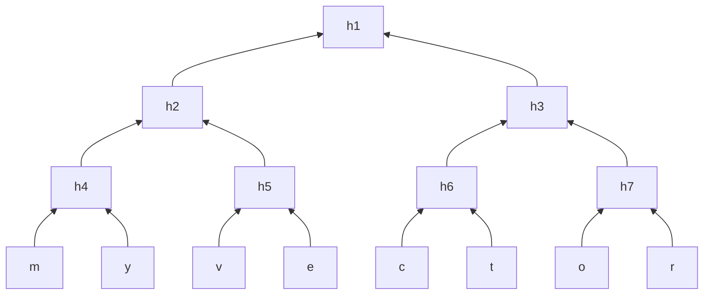

# Merkle Tree

Merkle Tree is a very famous vector commitment scheme. Here is a vector commitment to the vector `[m, y, v, e, c, t, o, r]`.

In this binary tree, every node is made up of the hash of its children:

- $h_1 = H(h_2, h_3)$
- $h_2 = H(h_4, h_5)$
- and so on…

The leaf nodes are the elements of the committed vector, `m`, `y`, `v`, and such. The root $h_1$ is the **commitment** to this vector!

When the prover is asked to show that indeed some element of the vector exists at some position, it will provide only the necessary nodes. For example, a verifier could ask "is there really a `t` at position 6?". The prover will give: `c`, `t`, $h_7$ and $h_2$. The verifier will do the following:

- $h_6 = H(c, t)$
- $h_3 = H(h_6, h_7)$
- $h_1 = H(h_2, h_3)$

Then, the verifier will compare the calculate $h_1$ to the root given as a commitment by the prover. If they match, then `t` is indeed at that specific position in the committed vector! The way this cryptographically works is due to collision resistance in hash functions.
