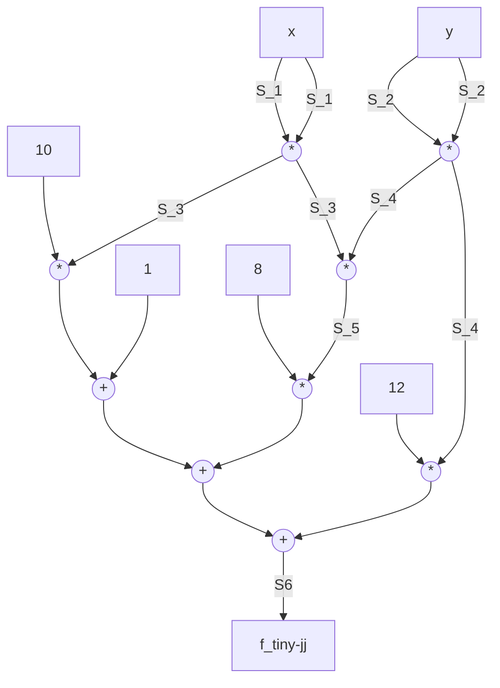
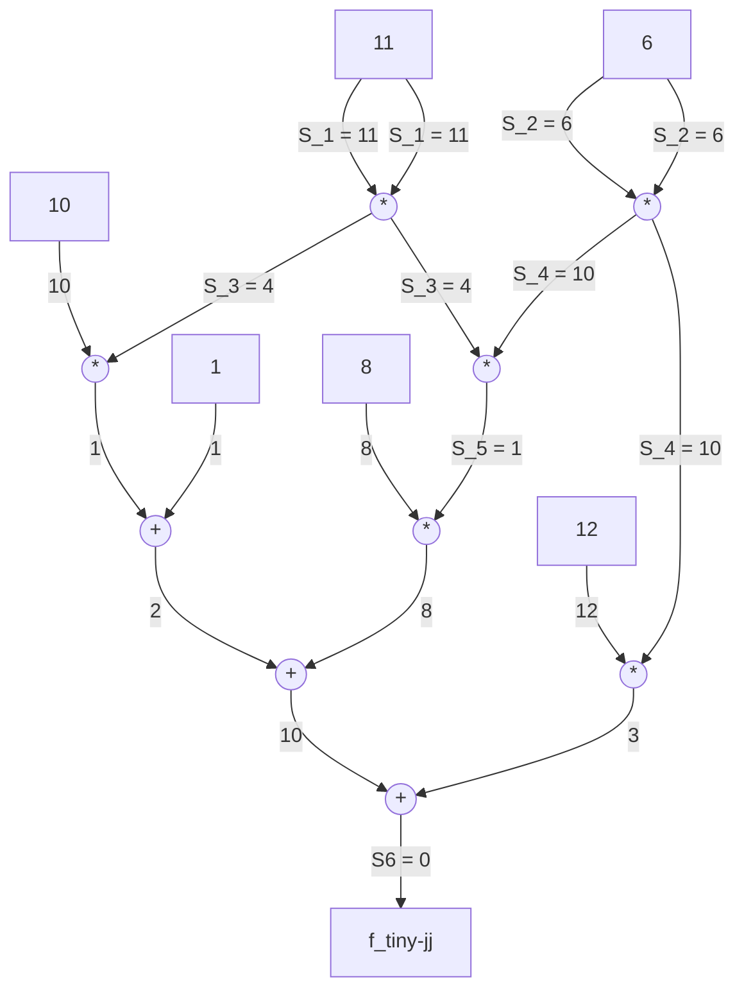

# Chapter 6: Statements

## Exercise 96

> Define a decision function such that the associated language $L_{Exercise_1}$ consists of all solutions to the equation $5x + 4 = 28 + 2x$ over $\mathbb{F}_{13}$.
>
> Provide a constructive proof for the claim: "There exists a word in $L_{Exercise_1}$" and verify the proof.

The decision function can be written as follows:

$$
R_{Exercise_1} : (\mathbb{F}_{13})^* \to \{true, false\} ;
$$

$$
\langle x_1, \ldots, x_n \rangle
\mapsto
\begin{cases}
true & n = 1 \text{ and } 5x_1+4 = 28 + 2x_1 \\
false & else
\end{cases}
$$

We can find the solution $x$ as follows:

- Moving $x$ to left-side and others to the right: $3x = 24$
- Taking modulo 13 to get: $3x = 11$
- Inverse of $3$ is $9$ in this field, so we have $x = 11 * 9$ which is $x = 8$ in mod 13.

So, the string $\langle 8 \rangle$ is a constructive proof and the computation $R_{Exercise_1}(\langle 8 \rangle) = true$ verifies the proof.

## Exercise 97

> Consider modular 6 arithmetic $(\mathbb{Z}_6)$, the alphabet $\Sigma = \mathbb{Z}_6$ and the following decision function:
>
> $$
>  R_{example_{11}} : \Sigma^\ast \to \{true, false\} ;
> $$
>
> $$
> \langle x_1, \ldots,  x_n \rangle
>   \mapsto
>   \begin{cases}
>   true & n = 1 \text{ and } 3x_1 + 3 = 0 \\
>   false & else
>   \end{cases}
> $$
>
> Compute all words in the associated language $L_{example_{11}}$, provide a constructive proof for the statement "There exist a word in $L_{example_{11}}$" and verify the proof.

Looking at words with $n=1$, we have $\langle 0 \rangle, \langle 1 \rangle, \langle 2 \rangle, \langle 3 \rangle, \langle 4 \rangle, \langle 5 \rangle$. From these, $\langle 1 \rangle$ and $\langle 5 \rangle$ fit the whole grammar as $3(1) + 3 = 6 \equiv 0 \pmod{6}$ and $3(5)+3 = 18 \equiv 0 \pmod{6}$.

## Exercise 98

> Consider modular 6 arithmetic $(\mathbb{Z}_6)$, the alphabets $\Sigma_I$ and $\Sigma_W$ and the following decision function:
>
> $$
>  R_{linear} : \Sigma^\ast \times \Sigma^\ast \to \{true, false\} ;
> $$
>
> $$
> (i; w)
>   \mapsto
>   \begin{cases}
>   true & |i| = 3 \text{ and } |w| = 1 \text{ and } i_1 \cdot w_1 + i_2 = i_3 \\
>   false & else
>   \end{cases}
> $$
>
> Which of the following instances has a proof of knowledge in $R_{linear}$?
>
> - $(3, 3, 0)$
> - $(2, 1, 0)$
> - $(4, 4, 2)$

- Witness is $1$ for $(3, 3, 0)$,
- Witness is $1$ for $(4, 4, 2)$,
- There is no witness for $(2, 1, 0)$, as we cant find a $w$ that makes the equation hold.

## Exercise 99 ✨

> Consider the TinyJubJub curve together with its twisted Edwards addition law. Define an instance alphabet $\Sigma_I$, a witness alphabet $\Sigma_W$ and a decision function $R_{add}$ with associated language $L_{add}$ such that a string $(i;w) \in \Sigma_I^\ast \times \Sigma_W^\ast$ is a word in $L_{add}$ if and only if $i$ is a pair of curve points on the TinyJubJub curve in Edwards form, and $w$ is the sum of those curve points.
>
> With that, give example of an instance with a proof, and another example with an instance with no proof.

Twisted Edwards addition law for TinyJubJub is the following $(a = 3, d = 8)$:

$$
(x_1, y_1) \oplus (x_2, y_2) =
\left(
\frac
{x_1y_2 + y_1x_2}
{1 + 8x_1x_2y_1y_2}
,
\frac
{y_1y_2 - 3x_1x_2}
{1 - 8x_1x_2y_1y_2}
\right)
$$

for $x_1, y_1, x_2, y_2 \in \mathbb{F}_{13}$. Our instance is composed of two points, each a pair of field elements; our witness is just a single point, a pair of field elements.

Both alphabets are thus field elements:

- $\Sigma_I = \mathbb{F}_{13}$
- $\Sigma_W = \mathbb{F}_{13}$

Perhaps we could set our alphabet to equal a pair of field elements, that is $(\mathbb{F}_{13})^2$, but I've preferred the above approach.

To make things easier, we will also re-use $L_{tiny-jj}$ from a previous example, which is a language such that if $a \in L_{tiny-jj}$ then $a$ is a word that is a pair of field elements corresponding to a point on the curve.

With that, our grammar $R_{add}$ is defined as:

$$
R_{add} : (\mathbb{F}_{13})^\ast \times (\mathbb{F}_{13})^\ast \to \{true, false\} ;
$$

$$
(i ; w) \mapsto
\begin{cases}
true  & &(\langle i_1, i_2 \rangle) \in L_{tiny-jj} \\
      & \text{ and } &(\langle i_3, i_4 \rangle) \in L_{tiny-jj} \\
      & \text{ and } &(w_1, w_2) =
\left(
\frac
{i_1i_4 + i_2i_3}
{1 + 8i_1i_3i_2i_4}
,
\frac
{i_2i_4 - 3i_1i_3}
{1 - 8i_1i_3i_2i_4}
\right) \\

false & else
\end{cases}
$$

The language $L_{add}$ is defined as:

$$
L_{add} := \{(i;w) \in \Sigma_I^\ast \times \Sigma_W^\ast | R_{add}(i; w) = true \}
$$

To provide an instance with knowledge proof, we can just pick two points in the curve and sum them as the witness. To provide an instance with no proof, we can let one of the points to be outside the curve and that would suffice.

## Exercise 100

> Consider the language $L_{add}$ from exercise 99. Define an R1CS such that words in $L_{add}$ are in 1:1 correspondance with solutions to this R1CS.

What we need is an R1CS for the following computation:

$$
(x_1, y_1) \oplus (x_2, y_2) =
\left(
 \frac{x_1y_2 + y_1x_2}{1 + 8x_1x_2y_1y_2}
,\frac{y_1y_2 - 3x_1x_2}{1 - 8x_1x_2y_1y_2}
\right)
$$

where the result is denoted as $(x_3, y_3)$. Notice that we have a multiplicative inverse here, which is a problem for the R1CS description that we need. Instead, we will show that

$$
\begin{align*}
    (1 + 8x_1x_2y_1y_2) \times x_3 &= x_1y_2 + y_1x_2  \\
    (1 - 8x_1x_2y_1y_2) \times y_3 &= y_1y_2 - 3x_1x_2
\end{align*}
$$

We define the intermediate variables (which are also witnesses) and the constraints for the two equations above as follows:

$$
\begin{align}
    x_1 \cdot y_2 &= W_1 \\
    x_2 \cdot y_1 &= W_2 \\
    x_1 \cdot x_2 &= W_3 \\
    y_1 \cdot y_2 &= W_4 \\
    (8 \cdot W_1) \cdot W_2 &= W_5 \\
    (1 + W_5) \cdot x_3 &= W_1 + W_2 \\
    (1 - W_5) \cdot y_3 &= W_4 - 3\cdot W_3
\end{align}
$$

With this, we have an R1CS with $n=4$ instances (the two input points), $m=7$ witnesses (one point and the intermediate variables via _flattening_), and $k=7$ for the 7 constraints shown above. For the instance and witnesses, we will have $I_1 = x_1, I_2 = y_1, I_3 = x_2, I_4 = y_2$ and $W_6 = x_3, W_7 = y_3$. With this definition, the columns of our matrix will show the coefficients of the variables as:

$$
\text{constant} \mid x_1 \mid y_1 \mid x_2 \mid y_2 \mid W_1 \mid W_2 \mid W_3 \mid W_4 \mid W_5 \mid x_3 \mid y_3
$$

Let's work with the matrices now.

Our first matrix $A$ is:

$$
A = \begin{pmatrix}
% 0  x1  y1  x2  y2  W1  W2  W3  W4  W5  x3  y3
  0 &1  &0  &0  &0  &0  &0  &0  &0  &0  &0  &0 \\
  0 &0  &0  &1  &0  &0  &0  &0  &0  &0  &0  &0 \\
  0 &1  &0  &0  &0  &0  &0  &0  &0  &0  &0  &0 \\
  0 &0  &1  &0  &0  &0  &0  &0  &0  &0  &0  &0 \\
  0 &0  &0  &0  &0  &8  &0  &0  &0  &0  &0  &0 \\
  1 &0  &0  &0  &0  &0  &0  &0  &0  &1  &0  &0 \\
  1 &0  &0  &0  &0  &0  &0  &0  &0  &-1  &0  &0 \\
\end{pmatrix}
$$

Our second matrix $B$ is:

$$
% 0 &0  &0  &0  &0  &0  &0  &0  &0  &0  &0  &0 \\
B = \begin{pmatrix}
% 0  x1  y1  x2  y2  W1  W2  W3  W4  W5  x3  y3
  0 &0  &0  &0  &1  &0  &0  &0  &0  &0  &0  &0 \\
  0 &0  &1  &0  &0  &0  &0  &0  &0  &0  &0  &0 \\
  0 &0  &0  &1  &0  &0  &0  &0  &0  &0  &0  &0 \\
  0 &0  &0  &0  &1  &0  &0  &0  &0  &0  &0  &0 \\
  0 &0  &0  &0  &0  &0  &1  &0  &0  &0  &0  &0 \\
  0 &0  &0  &0  &0  &0  &0  &0  &0  &0  &1  &0 \\
  0 &0  &0  &0  &0  &0  &0  &0  &0  &0  &0  &1
\end{pmatrix}
$$

Our third matrix $C$ is:

$$
C = \begin{pmatrix}
% 0  x1  y1  x2  y2  W1  W2  W3  W4  W5  x3  y3
  0 &0  &0  &0  &0  &1  &0  &0  &0  &0  &0  &0 \\
  0 &0  &0  &0  &0  &0  &1  &0  &0  &0  &0  &0 \\
  0 &0  &0  &0  &0  &0  &0  &1  &0  &0  &0  &0 \\
  0 &0  &0  &0  &0  &0  &0  &0  &1  &0  &0  &0 \\
  0 &0  &0  &0  &0  &0  &0  &0  &0  &1  &0  &0 \\
  0 &0  &0  &0  &0  &1  &1  &0  &0  &0  &0  &0 \\
  0 &0  &0  &0  &0  &0  &0  &-3  &1  &0  &0  &0
\end{pmatrix}
$$

Define an R1CS $S_{add}$ as $Ax \odot Bx = Cx$ where $A, B, C$ is given above, and $x = (1, I, W) \in \mathbb{F}_{13}^{12}$. The final R1CS for $L_{add}$ is given by the union of $S_{add}$ and the R1CS from example 121 applied to both input points to ensure that they are on the curve.

## Exercise 101

> Consider the circuit $C_{tiny-jj}(\mathbb{F}_{13})$ with it's associated language $L_{tiny-jj}$. Construct a proof $\pi$ for the instance $\langle 11, 6 \rangle$ and verify the proof.

The said circuit outputs 0 when the given point coordinates $x, y$ hold for the equation of the TinyJubJub curve in twisted Edwards form:

$$
3(x^2) + y^2 = 1 + 8(x^2)(y^2)
$$

To be more precise, the circuit calculates the following expression which is just a re-arrangment of the above equation such that one side is equal to 0:

$$
1 + 8(x^2)(y^2) + 10(x^2) + 12(y^2)
$$

Here is the circuit using MermaidJS:



The proof will be to find the correct values for wire labels given the inputs $\langle 11, 6 \rangle$. That is:



Indeed, we got the output to be 0 and we have a valid set of assignments to prove it! Our proof $\pi$, that is the assignments for $\langle S_1, S_2, S_3, S_4, S_5, S_6 \rangle$ are:

$$
\pi = \langle 11, 6, 4, 10, 1, 0 \rangle
$$

## Exercise 102 ✨

> Consider the R1CS for points on the TinyJubJub curve. Compute an associated QAP for this R1CS and check your results with Sage.

We can define the `qap` function as:

```python
from sage.all import GF

def qap(r1cs, p: int):
    """
    Given a R1CS and a prime, returns the QAP (Quadratic Arithmetic Program).
    """
    # k := number of constraints
    k = len(r1cs[0])
    assert k < p

    # make sure lengths are alright
    cnt = len(r1cs[0][0])
    for term in range(3):
        # each term must have k constraints
        # and each constraint must have same amount of terms
        for cons in range(k):
            assert cnt == len(r1cs[term][cons])

    # polynomial over GF(p)
    Fp = GF(p)
    Fpx = Fp["x"]

    # pick k random elements, unique & invertible
    elems = []
    for _ in range(k):
        rand_elem = Fp.random_element()
        if rand_elem not in elems:
            elems.append(rand_elem)

    # compute the target polynomial
    target = Fpx(1)
    for e in elems:
        target *= Fpx([-e, 1])  # x - e

    # compute the lagrange polynomials
    polys = ([], [], [])
    for term in range(3):
        for c in range(cnt):
            points = [(elems[cons], r1cs[term][cons][c]) for cons in range(k)]
            polys[term].append(Fpx.lagrange_polynomial(points))

    return (target, polys)
```

We give the R1CS along with the prime associated with TinyJubJub to `QAP`, and we find the following results:

```python
# prime for finite field of tinyjubjub
p = 13

# R1CS of tiny_jj language (from the book)
r1cs_tiny_jj = (
    # [c, I1, I2, W1, W2, W3]
    [  # A
        [0, 1, 0, 0, 0, 0],
        [0, 0, 1, 0, 0, 0],
        [0, 0, 0, 8, 0, 0],
        [1, 0, 0, 10, 12, 1],
    ],
    [  # B
        [0, 1, 0, 0, 0, 0],
        [0, 0, 1, 0, 0, 0],
        [0, 0, 0, 0, 1, 0],
        [1, 0, 0, 0, 0, 1],
    ],
    [  # C
        [0, 0, 0, 1, 0, 0],
        [0, 0, 0, 0, 1, 0],
        [0, 0, 0, 0, 0, 1],
        [0, 0, 0, 0, 0, 0],
    ],
)

QAP = qap(r1cs_tiny_jj, p)
print("Target Polynomial")
print(QAP[0])

print("\nPolynomials (A)")
print(QAP[1][0])

print("\nPolynomials (B)")
print(QAP[1][1])

print("\nPolynomials (C)")
print(QAP[1][2])
```

    Target Polynomial
    x^4 + 6*x^3 + 7*x^2 + 2*x

    Polynomials (A)
    [5*x^3 + 3*x^2 + 11*x, 7*x^3 + 11*x^2 + 4*x, 7*x^3 + 9*x^2 + x, 2*x^3 + 2*x^2 + 8*x + 8, 8*x^3 + 10*x^2 + 2*x, 5*x^3 + 3*x^2 + 11*x]

    Polynomials (B)
    [5*x^3 + 3*x^2 + 11*x, 7*x^3 + 11*x^2 + 4*x, 7*x^3 + 9*x^2 + x, 0, 7*x^3 + 3*x^2 + 10*x + 1, 5*x^3 + 3*x^2 + 11*x]

    Polynomials (C)
    [0, 0, 0, 7*x^3 + 11*x^2 + 4*x, 7*x^3 + 9*x^2 + x, 7*x^3 + 3*x^2 + 10*x + 1]
